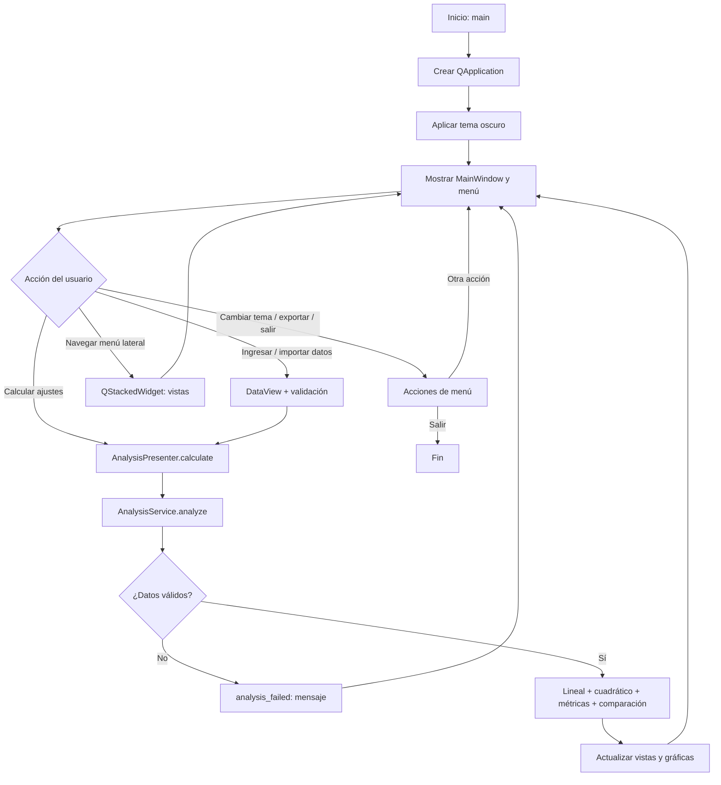

# Diagrama de flujo general

Corresponde a `aproxlab.main:main` y `MainWindow`.

```mermaid
flowchart TD
    A[Inicio: main] --> B[Crear QApplication]
    B --> C[Aplicar tema oscuro]
    C --> D[Mostrar MainWindow y menú]
    D --> E{Acción del usuario}
    E -->|Ingresar / importar datos| F[DataView + validación]
    E -->|Calcular ajustes| G[AnalysisPresenter.calculate]
    E -->|Navegar menú lateral| H[QStackedWidget: vistas]
    E -->|Cambiar tema / exportar / salir| I[Acciones de menú]
    F --> G
    G --> J[AnalysisService.analyze]
    J --> K{¿Datos válidos?}
    K -->|No| L[analysis_failed: mensaje]
    K -->|Sí| M[Lineal + cuadrático + métricas + comparación]
    M --> N[Actualizar vistas y gráficas]
    L --> D
    N --> D
    H --> D
    I -->|Salir| O[Fin]
    I -->|Otra acción| D
```
