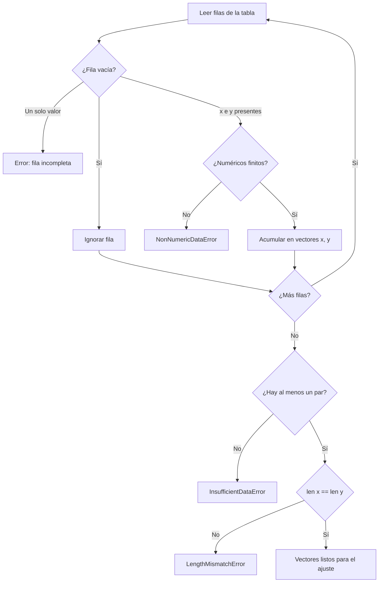

# Ingreso y validación de datos

Corresponde a `DatasetTableModel.numeric_pairs`, `prepare_dataset` y `require_min_points`.

```mermaid
flowchart TD
    A[Leer filas de la tabla] --> B{¿Fila vacía?}
    B -->|Sí| C[Ignorar fila]
    B -->|Un solo valor| D[Error: fila incompleta]
    B -->|x e y presentes| E{¿Numéricos finitos?}
    E -->|No| F[NonNumericDataError]
    E -->|Sí| G[Acumular en vectores x, y]
    C --> H{¿Más filas?}
    G --> H
    H -->|Sí| A
    H -->|No| I{¿Hay al menos un par?}
    I -->|No| J[InsufficientDataError]
    I -->|Sí| K{len x == len y}
    K -->|No| L[LengthMismatchError]
    K -->|Sí| M[Vectores listos para el ajuste]
```
