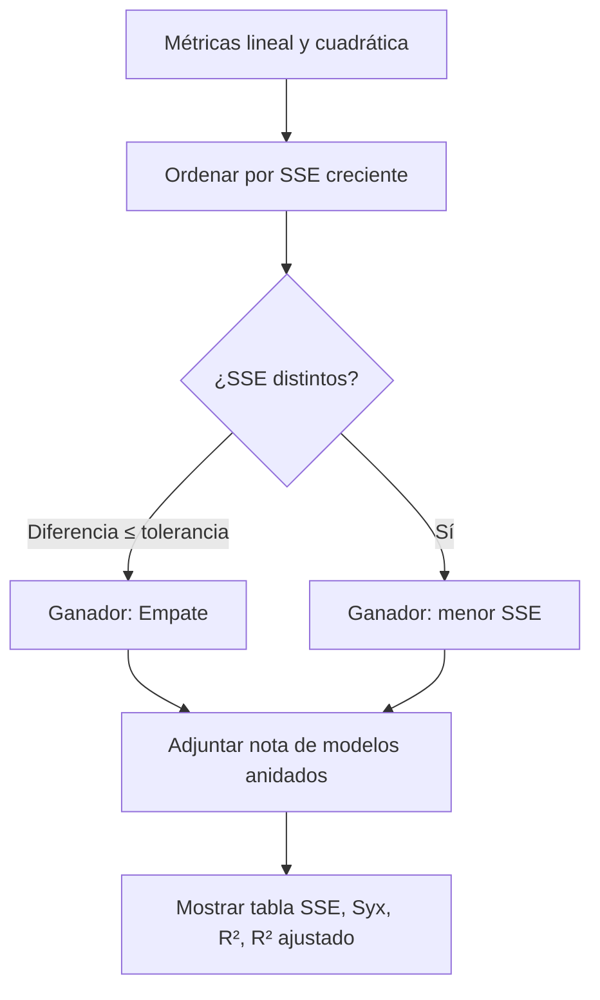

# Comparación de modelos

Corresponde a `compare_models` y `ComparisonView`.

```mermaid
flowchart TD
    A[Métricas lineal y cuadrática] --> B[Ordenar por SSE creciente]
    B --> C{¿SSE distintos?}
    C -->|Diferencia ≤ tolerancia| D[Ganador: Empate]
    C -->|Sí| E[Ganador: menor SSE]
    D --> F[Adjuntar nota de modelos anidados]
    E --> F
    F --> G[Mostrar tabla SSE, Syx, R², R² ajustado]
```
