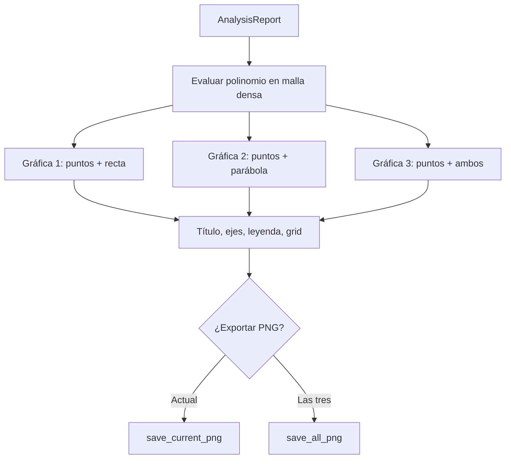

# Generación de gráficas

Corresponde a `plot_scatter_and_fits` y `ChartsView.show_report`.

```mermaid
flowchart TD
    A[AnalysisReport] --> B[Evaluar polinomio en malla densa]
    B --> C[Gráfica 1: puntos + recta]
    B --> D[Gráfica 2: puntos + parábola]
    B --> E[Gráfica 3: puntos + ambos]
    C --> F[Título, ejes, leyenda, grid]
    D --> F
    E --> F
    F --> G{¿Exportar PNG?}
    G -->|Actual| H[save_current_png]
    G -->|Las tres| I[save_all_png]
```
