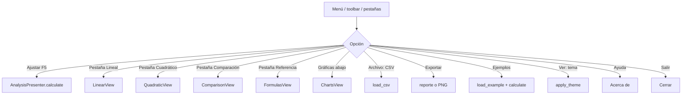

# Menú principal

Corresponde a `MainWindow` (menú, toolbar y pestañas del banco de trabajo).

```mermaid
flowchart TD
    A[Menú / toolbar / pestañas] --> B{Opción}
    B -->|Ajustar F5| C[AnalysisPresenter.calculate]
    B -->|Pestaña Lineal| D[LinearView]
    B -->|Pestaña Cuadrático| E[QuadraticView]
    B -->|Pestaña Comparación| F[ComparisonView]
    B -->|Pestaña Referencia| G[FormulasView]
    B -->|Gráficas abajo| H[ChartsView]
    B -->|Archivo: CSV| I[load_csv]
    B -->|Exportar| J[reporte o PNG]
    B -->|Ejemplos| K[load_example + calculate]
    B -->|Ver: tema| L[apply_theme]
    B -->|Ayuda| M[Acerca de]
    B -->|Salir| N[Cerrar]
```
