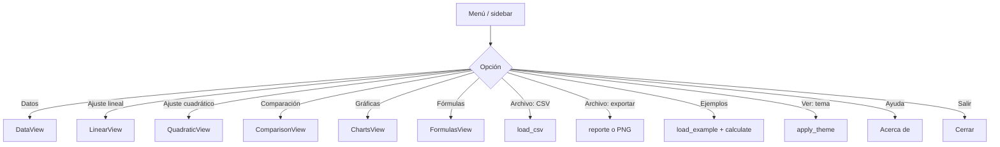

# Menú principal

Corresponde a `MainWindow._build_menus` y `Sidebar`.

```mermaid
flowchart TD
    A[Menú / sidebar] --> B{Opción}
    B -->|Datos| C[DataView]
    B -->|Ajuste lineal| D[LinearView]
    B -->|Ajuste cuadrático| E[QuadraticView]
    B -->|Comparación| F[ComparisonView]
    B -->|Gráficas| G[ChartsView]
    B -->|Fórmulas| H[FormulasView]
    B -->|Archivo: CSV| I[load_csv]
    B -->|Archivo: exportar| J[reporte o PNG]
    B -->|Ejemplos| K[load_example + calculate]
    B -->|Ver: tema| L[apply_theme]
    B -->|Ayuda| M[Acerca de]
    B -->|Salir| N[Cerrar]
```
