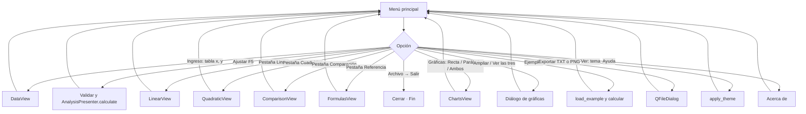

# Menú principal

Corresponde a `MainWindow._build_menus`, la barra de ejemplos y las pestañas del banco de trabajo.

```mermaid
flowchart TD
    A[Menú principal] --> B{Opción}
    B -->|Ingreso: tabla x, y| C[DataView]
    B -->|Ajustar F5| D[Validar y AnalysisPresenter.calculate]
    B -->|Pestaña Lineal| E[LinearView]
    B -->|Pestaña Cuadrático| F[QuadraticView]
    B -->|Pestaña Comparación| G[ComparisonView]
    B -->|Pestaña Referencia| H[FormulasView]
    B -->|Gráficas: Recta / Parábola / Ambos| I[ChartsView]
    B -->|Ampliar / Ver las tres| J[Diálogo de gráficas]
    B -->|Ejemplos| K[load_example y calcular]
    B -->|Exportar TXT o PNG| L[QFileDialog]
    B -->|Ver: tema| M[apply_theme]
    B -->|Ayuda| N[Acerca de]
    B -->|Archivo → Salir| O[Cerrar · Fin]
    C --> A
    D --> A
    E --> A
    F --> A
    G --> A
    H --> A
    I --> A
    J --> A
    K --> A
    L --> A
    M --> A
    N --> A
```
